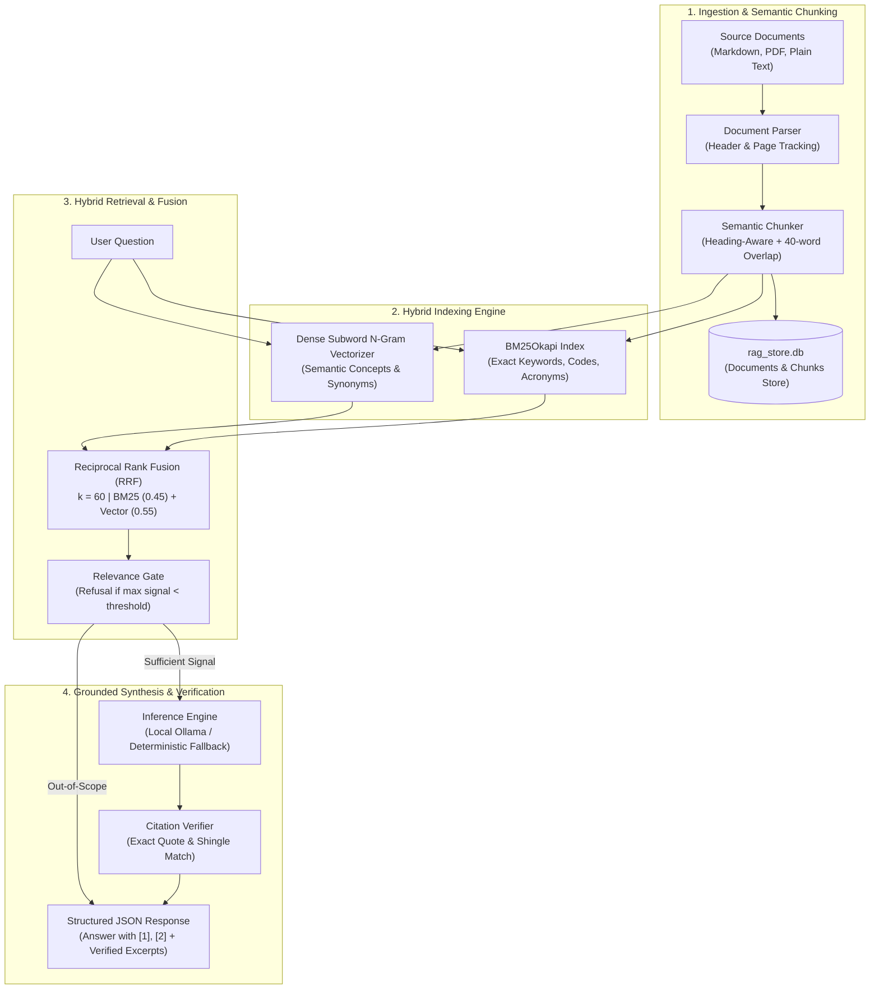

# Internal Document Knowledge Base & Verifiable Citation Engine (RAG)

A question-answering system operating over enterprise documentation (cloud security policies, employee handbooks, API architecture specifications) that combines semantic vector embeddings with an inverted BM25 keyword index and enforces exact source citation verification to prevent hallucinations.

---

## Architecture & Pipeline



---

## Technical Design Decisions

### 1. Hybrid Search (SQLite FTS5 BM25 + Dense Semantic Vectors)
Pure dense vector models frequently fail on technical documentation when users search for specific acronyms, error codes, or numbers (e.g., `401(k)`, `FIDO2`, `MFA`, `HTTP 429`, `DLQ`, `TLS 1.3`). Conversely, pure keyword search fails when queries use conceptual synonyms.

We solve this using **Reciprocal Rank Fusion (RRF)** backed by SQLite's native `fts5` full-text search engine (with Porter unicode tokenization and automatic sync triggers) alongside dense subword vectorization:
$$\text{RRF Score}(d) = w_{\text{bm25}} \cdot \frac{1}{60 + \text{Rank}_{\text{bm25}}(d)} + w_{\text{vector}} \cdot \frac{1}{60 + \text{Rank}_{\text{vector}}(d)}$$

### 2. Context-Aware Semantic Chunking & Table Preservation
Blind character chunking splits paragraphs across sentences, causing loss of critical facts (such as policy exclusions, SLA tables, or conditional clauses). Our chunker:
- Respects markdown header hierarchies (`#`, `##`, `###`) and document page breaks.
- Detects markdown tables and keeps them atomic and indivisible across chunk boundaries.
- Retains section titles and parent headings as searchable metadata on every chunk.
- Maintains a 40-word sliding boundary overlap for sections exceeding the 250-word target window.

### 3. Strict Hallucination Refusal Guardrail
When a question is outside the scope of indexed documents (e.g., asking for baking recipes or unrelated topics), standard LLMs often fabricate believable answers. Our retrieval gate checks maximum BM25 and cosine similarity scores: if neither keyword nor semantic signal meets the threshold, the system immediately returns an out-of-scope refusal response without invoking generative completion.

### 4. Citation Verification Engine
Every claim references source chunks using bracket notation (`[1]`, `[2]`). The citation verifier inspects each cited excerpt against the raw source text:
- Verifies exact substring match.
- Checks 4-word shingle overlap ratio ($>70\%$ for partial match, $>90\%$ for exact match).
- Returns verification status (`verified`, `partial_match`, `unverified`) with exact page and section coordinates.

---

## Quickstart & Local Execution

### 1. Environment Setup
```bash
git clone https://github.com/TheIonius/rag-document-qa.git
cd rag-document-qa
python3 -m venv .venv
source .venv/bin/activate
pip install -r requirements.txt
```

### 2. Ingest Sample Documentation
```bash
python scripts/ingest_samples.py
```
Indexes sample enterprise documents:
- `data/documents/cloud_security_policy.md` (MFA, password rotation, incident SLAs, encryption)
- `data/documents/employee_benefits_handbook.md` (401(k) match, PTO, parental leave, health coverage)
- `data/documents/api_architecture_spec.md` (OAuth 2.0 JWT, rate limits, webhook exponential backoff)

### 3. Start the Server
```bash
uvicorn app.main:app --app-dir backend --port 8004
```
Open **`http://localhost:8004`** in your browser.

Or run with Docker:
```bash
docker compose up --build
```

---

## Automated Test Suite
Run the test suite verifying chunking, retrieval, API contracts, citation verification, and multi-tenant isolation:
```bash
pytest -v
```
All 27 unit and integration tests passing.
